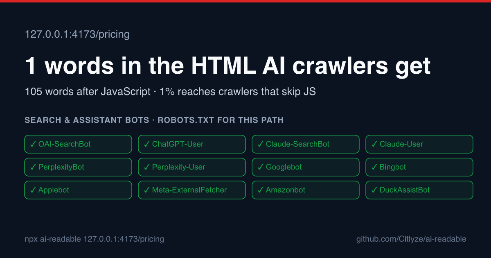

# ai-readable

**See what each AI crawler actually gets from your pages. Fail CI when a deploy makes a page unreadable to AI search.**

[](https://www.npmjs.com/package/ai-readable)
[](https://github.com/Citlyze/ai-readable/actions/workflows/ci.yml)
[](https://github.com/Citlyze/ai-readable/actions/workflows/self-check.yml)
[](LICENSE)

```bash
npx ai-readable example.com/pricing --render
```

```
https://example.com/pricing/
  40/100 AI readability · HTTP 200 · 1 word in the initial HTML

  ✓ 25/25  AI crawler access            No search or assistant bots are blocked for this path.
  ✓ 15/15  Reachable and indexable      HTTP 200, no noindex directive.
  ✗ 0/10   One descriptive H1           No H1 in the HTML.
  ✗ 0/12   Question-shaped headings     No H2 or H3 subheadings in the HTML.
  ✗ 0/15   Liftable answer blocks       0 headings followed by a 25 to 90 word paragraph.
  ! 0/10   Entity structured data       No JSON-LD entity markup.
  ! 0/8    Tables and lists             No tables and fewer than three list items. Comparative facts lift better from tables.
  ! 0/5    Title and meta description   Title "Pricing", no meta description.
  ·        llms.txt                     No llms.txt. Not scored: no major engine documents reading it.

  ✗        Initial HTML vs rendered     The H1 "Acme Widget Pro pricing plans" only exists after JavaScript runs.
                                        Initial HTML has 1 word, rendered has 105.

  What each AI crawler gets from this URL
  Search index · Builds the index AI answers retrieve from. Blocking removes your pages from live answers.
    OAI-SearchBot          OpenAI       allowed
    Claude-SearchBot       Anthropic    allowed
    PerplexityBot          Perplexity   allowed
    ...
```



Most AI retrieval crawlers do not run JavaScript. A pricing page that is one word of "Loading…" to them is invisible in AI answers no matter how good it looks in a browser. `ai-readable` shows you that gap, the robots.txt rule that blocks a search bot, the `noindex` that leaked from staging, and it keeps them from coming back.

## What it checks

Nine deterministic checks, scored out of 100. No API keys, no AI calls, nothing leaves your machine except the fetches of the page itself.

| Check | Points | Passes when |
|---|---:|---|
| AI crawler access | 25 | robots.txt does not block any search-index or assistant-fetch bot for this path. Training bots are ignored: blocking them does not change live answers. |
| Reachable and indexable | 15 | HTTP status below 400, no `noindex` in meta robots or `X-Robots-Tag`. |
| One descriptive H1 | 10 | Exactly one H1 of three or more words. Several: half credit. |
| Question-shaped headings | 12 | At least two H2/H3 headings phrased as questions. One: half credit. |
| Liftable answer blocks | 15 | At least two headings followed immediately by a 25 to 90 word paragraph. One: half credit. |
| Entity structured data | 10 | JSON-LD with Organization, Product, Article or a similar entity type. FAQPage alone earns nothing. |
| Tables and lists | 8 | At least one table or three list items. |
| Title and meta description | 5 | Title of 15+ characters and description of 50+. |
| llms.txt | 0 | Reported only. No major engine documents reading it. |

With `--render`, the page is also loaded in headless Chromium and compared with the initial HTML: share of rendered words present in the HTML (warn under 80%, fail under 50%), and headings that only exist after JavaScript.

The per-bot table lists 19 documented AI crawlers with the exact robots.txt line that decided each verdict. `npx ai-readable bots` prints them with vendor documentation links.

## Keep it green in CI

```bash
npx ai-readable init --base-url https://example.com
npx ai-readable ci --update-baseline
git add ai-readable.config.json .ai-readable .github && git commit -m "ai-readable gate"
```

The generated workflow runs on every pull request and fails when a configured page regresses against the committed baseline:

- the score drops more than 5 points (configurable),
- a check goes from pass to warn or fail,
- a search or assistant bot that was allowed becomes blocked,
- the rendered gap gets worse,
- a page is `noindex` or returns an error (always, baseline or not).

It posts one comment on the pull request, updated in place, with the before and after table and a link to the fix recipe for each failure. On `main` it refreshes the baseline and the badge:

```markdown

```

Or use the Action directly:

```yaml
- uses: Citlyze/ai-readable@v1
  with:
    base-url: ${{ github.event.deployment_status.environment_url }}
    headers: |
      x-vercel-protection-bypass: ${{ secrets.VERCEL_AUTOMATION_BYPASS_SECRET }}
```

[docs/ci-setup.md](docs/ci-setup.md) covers Vercel and Netlify previews, GitHub Pages, protected staging, and the rules.

## Fix it with your coding agent

The repository is also an [Agent Skill](https://agentskills.io). Install it once and ask Claude Code, Codex, Cursor or Gemini CLI to "make this page AI readable":

```bash
npx skills add Citlyze/ai-readable
```

Claude Code plugin:

```
/plugin marketplace add Citlyze/ai-readable
/plugin install ai-readable@ai-readable
```

The skill runs the check, picks the recipe for your framework, applies the smallest fix, and reruns until green. It stops and asks before changing prices, claims or brand copy.

Recipes: [Next.js](docs/recipes/nextjs.md) · [Astro](docs/recipes/astro.md) · [Vite / Lovable / v0 / Bolt exports](docs/recipes/spa-export.md) · [robots.txt](docs/recipes/robots.md)

## Commands

| Command | What it does |
|---|---|
| `ai-readable <url...>` | Check pages. `--render`, `--json`, `--md`, `--card out.svg\|png`, `--header "Name: value"`, `--bots all` |
| `ai-readable ci` | Gate configured paths against the baseline. `--base-url`, `--paths`, `--no-render`, `--update-baseline`, `--fail-on never`, `--json` |
| `ai-readable init` | Write `ai-readable.config.json` and a GitHub Actions workflow |
| `ai-readable bots` | List the documented AI crawlers by category |

Programmatic use: `import { auditUrl } from "ai-readable"` returns the same report as `--json` ([schema](docs/report-schema.md)).

## What it does not do

- It never spoofs bot user agents. CDNs verify real crawlers by IP, so a spoofed request tells you about the CDN, not about the crawler. Verdicts come from robots.txt rules and the initial HTML, which is what crawlers read.
- It does not know whether AI engines mention or cite you. A green check means they can read the page. Whether they use it is a different question, tracked over time by [Citlyze](https://www.citlyze.com), the company that maintains this tool.

## Examples

[examples/](examples/README.md) has reports and share cards for twenty public pricing pages. The fixture site at [citlyze.github.io/ai-readable](https://citlyze.github.io/ai-readable/) has one deliberately broken page per failure class; the [self-check workflow](.github/workflows/self-check.yml) runs the Action against it on every push.

## Contributing

Add a bot with its vendor documentation link, add a framework recipe, or report a wrong result with the URL. See [CONTRIBUTING.md](CONTRIBUTING.md).

MIT © [Citlyze](https://www.citlyze.com)
