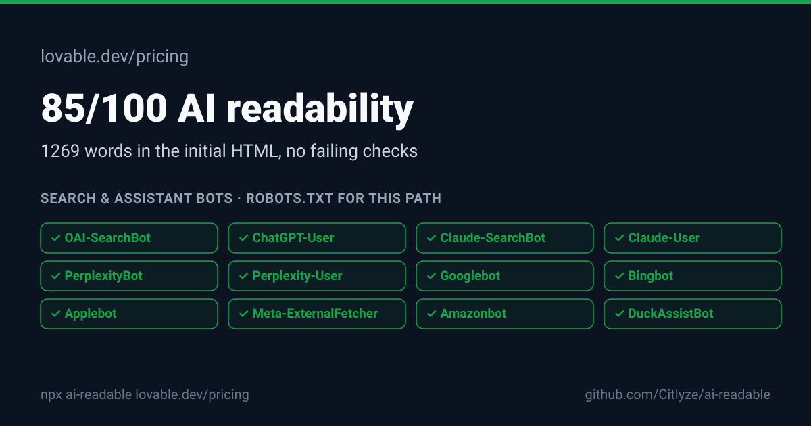

## https://lovable.dev/pricing

**85/100** AI readability · HTTP 200 · 1269 words in the initial HTML

| | Check | Points | Evidence |
|---|---|---:|---|
| ✅ | AI crawler access | 25/25 | No search or assistant bots are blocked for this path. |
| ✅ | Reachable and indexable | 15/15 | HTTP 200, no noindex directive. |
| ⚠️ | One descriptive H1 | 5/10 | The H1 is "Pricing". Name the thing and what it is. |
| ✅ | Question-shaped headings | 12/12 | 14 of 22 subheadings are questions (for example "What is Lovable and how does it work?"). |
| ✅ | Liftable answer blocks | 15/15 | 10 headings followed by a 25 to 90 word paragraph. |
| ⚠️ | Entity structured data | 0/10 | JSON-LD present (website, faqpage, question) but no Organization, Product, Article or similar entity type. |
| ✅ | Tables and lists | 8/8 | 1 table, 63 list items. |
| ✅ | Title and meta description | 5/5 | Title 15 chars, description 148 chars. |
| ℹ️ | llms.txt |  | llms.txt found. Not scored: no major engine documents reading it. |

### What each AI crawler gets

| Bot | Org | Category | Access | robots.txt rule |
|---|---|---|---|---|
| OAI-SearchBot | OpenAI | Search index | ✅ allowed | `Allow: /` (line 53) |
| ChatGPT-User | OpenAI | Assistant fetch | ✅ allowed | `Allow: /` (line 39) |
| Claude-SearchBot | Anthropic | Search index | ✅ allowed | `Allow: /` (line 2) |
| Claude-User | Anthropic | Assistant fetch | ✅ allowed | `Allow: /` (line 39) |
| PerplexityBot | Perplexity | Search index | ✅ allowed | `Allow: /` (line 53) |
| Perplexity-User | Perplexity | Assistant fetch | ✅ allowed | `Allow: /` (line 2) |
| Googlebot | Google | Search index | ✅ allowed | `Allow: /` (line 2) |
| Bingbot | Microsoft | Search index | ✅ allowed | `Allow: /` (line 2) |
| Applebot | Apple | Search index | ✅ allowed | `Allow: /` (line 2) |
| Meta-ExternalFetcher | Meta | Assistant fetch | ✅ allowed | `Allow: /` (line 2) |
| Amazonbot | Amazon | Search index | ✅ allowed | `Allow: /` (line 2) |
| DuckAssistBot | DuckDuckGo | Assistant fetch | ✅ allowed | `Allow: /` (line 2) |
| MistralAI-User | Mistral AI | Assistant fetch | ✅ allowed | `Allow: /` (line 2) |

Training bots: 6 of 6 allowed. Collects content for model training. Blocking does not change what live answers can cite.

