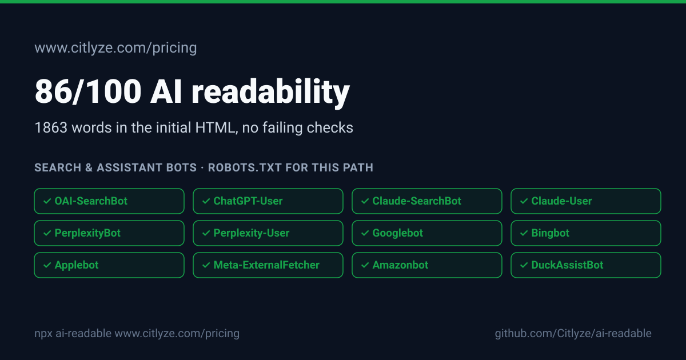

## https://www.citlyze.com/pricing

**86/100** AI readability · HTTP 200 · 1863 words in the initial HTML

| | Check | Points | Evidence |
|---|---|---:|---|
| ✅ | AI crawler access | 25/25 | No search or assistant bots are blocked for this path. |
| ✅ | Reachable and indexable | 15/15 | HTTP 200, no noindex directive. |
| ✅ | One descriptive H1 | 10/10 | H1: "Choose your AI visibility coverage". |
| ⚠️ | Question-shaped headings | 6/12 | 1 of 14 subheadings are questions (for example "Does AI recommend you when buyers ask?"). |
| ⚠️ | Liftable answer blocks | 7/15 | 1 heading followed by a 25 to 90 word paragraph. |
| ✅ | Entity structured data | 10/10 | JSON-LD: softwareapplication, breadcrumblist. |
| ✅ | Tables and lists | 8/8 | 1 table, 101 list items. |
| ✅ | Title and meta description | 5/5 | Title 54 chars, description 142 chars. |
| ℹ️ | llms.txt |  | llms.txt found. Not scored: no major engine documents reading it. |

### What each AI crawler gets

| Bot | Org | Category | Access | robots.txt rule |
|---|---|---|---|---|
| OAI-SearchBot | OpenAI | Search index | ✅ allowed | `Allow: /` (line 35) |
| ChatGPT-User | OpenAI | Assistant fetch | ✅ allowed | `Allow: /` (line 35) |
| Claude-SearchBot | Anthropic | Search index | ✅ allowed | `Allow: /` (line 35) |
| Claude-User | Anthropic | Assistant fetch | ✅ allowed | `Allow: /` (line 35) |
| PerplexityBot | Perplexity | Search index | ✅ allowed | `Allow: /` (line 35) |
| Perplexity-User | Perplexity | Assistant fetch | ✅ allowed | `Allow: /` (line 35) |
| Googlebot | Google | Search index | ✅ allowed | `Allow: /` (line 2) |
| Bingbot | Microsoft | Search index | ✅ allowed | `Allow: /` (line 2) |
| Applebot | Apple | Search index | ✅ allowed | `Allow: /` (line 2) |
| Meta-ExternalFetcher | Meta | Assistant fetch | ✅ allowed | `Allow: /` (line 2) |
| Amazonbot | Amazon | Search index | ✅ allowed | `Allow: /` (line 35) |
| DuckAssistBot | DuckDuckGo | Assistant fetch | ✅ allowed | `Allow: /` (line 35) |
| MistralAI-User | Mistral AI | Assistant fetch | ✅ allowed | `Allow: /` (line 2) |

Training bots: 6 of 6 allowed. Collects content for model training. Blocking does not change what live answers can cite.

